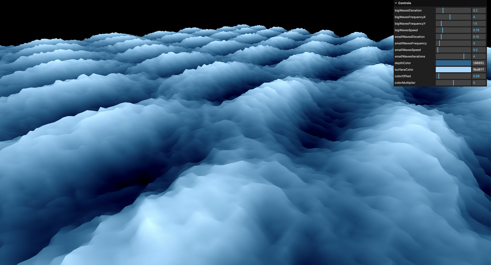

# Raging Sea

This project explores animating shaders and patterns. It was created with Three.js.

It features a features a low-poly sea with rolling waves. In the upper-right corner is a GUI that allows users to dynamically adjust multiple parameters for the scene, including wave elevation, frequency, and speed, small wave iterations, and sea colors.

The work was undertaken as one of many steps in acquiring [my Three.js certification](https://threejs-journey.com/certificate/view/24741) through [Three.js Journey](https://threejs-journey.com/).

## Live demo

A running demo of the project can be viewed at https://dvdjrnx.github.io/raging-sea

## Local development

### Installation

1. Clone the repository.
2. Install the required dependencies by running `npm install`.

### Usage

To start the project, run the following command:

`npm run dev`
